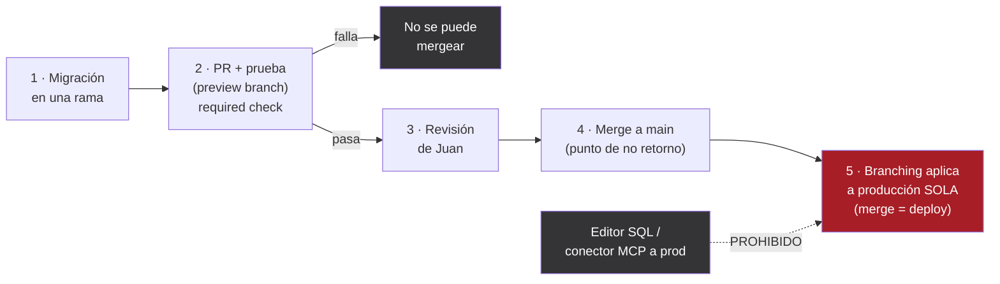

# TakeOS — Arquitectura Técnica y Flujo de Trabajo de Equipo

**Versión:** 1.8
**Fecha:** 8 de julio de 2026
**Autor:** Chat de Profesor/Asesor de Software (Claude), por encargo de Agustín Muñoz Rocha
**Estado:** **Aprobada y en ejecución** — Prioridad #1 y #2 **cerradas**; Prioridad #3 (modularización con Vite) **esencialmente completa en `staging/main`** (arquitectura modular de 25 módulos, delegación de eventos, CSP endurecida), **pendiente el corte a producción**, que hoy sigue en el monolito.
**Para quién es:** Agustín (product owner) y Juan de la Cuadra (CTO del proyecto)
**Documentos relacionados:** PRD V3.6 · ADR de Backend v1.12 · Roadmap Operativo v1.10 · Seguridad OWASP Top 10:2025 v1.5

> **⚠ Eje transversal desde v1.8 — producción ≠ staging.** El Informe Técnico de Arquitectura (6-jul) halló que **los dos remotos del repo ya no son el mismo software** y divergieron **189 commits**: `origin/main` (`fa008d5`) sirve el **monolito** (producción real: `index.html` de 28.649 líneas, 549 handlers inline, CSP con `unsafe-inline`); `staging/main` (`4c8067b`) sirve la **arquitectura modular** que describe este documento. Salvo que se diga lo contrario, lo que sigue describe la **rama modular (staging)**; el estado de producción se marca aparte. Esta divergencia + el corte a producción son el **riesgo abierto principal** (§5).

> **Cambios respecto a v1.7** (esta versión — consolida el **Informe Técnico de Arquitectura del 6-jul**, `staging/main` @ `4c8067b`, con addenda 6–8-jul, + el cierre del handoff de Code de `service_role`):
> 1. **⚠ Producción ≠ staging (nuevo eje, encabezado + §2.4/§5).** Los dos remotos divergieron **189 commits**: producción = monolito, staging = modular. Todo estado de frontend y cifra viva se leen etiquetados por rama.
> 2. **Modularización esencialmente completa en staging (§2.4/§3/§7).** No es "Etapa 2 pendiente / <1% hecho": el monolito quedó reemplazado por **40 archivos ES Modules (25.327 líneas en `frontend/src/`: 14 `lib/` + 25 `modules/`)**, con un sistema de **delegación de eventos** que retiró los `onclick` inline, **ganchos** (inversión de control) y **época** multi-org. Lo que queda es el **corte a producción**, no la modularización.
> 3. **CSP endurecida en staging (§2.4).** `script-src` **sin `unsafe-inline`** (el premio del refactor); el navegador rechaza todo JS inline. Queda `style-src` (deuda "proyecto S"). Producción sigue con `unsafe-inline`.
> 4. **Cifras vivas duales (§2.2 y pie).** Producción (último censo): 77 tablas / 147 policies / 8→9 migraciones. Staging (censo del informe): **72 tablas · 157 policies · 76 funciones `SECURITY DEFINER` · 14 migraciones · 40 archivos · 25.327 líneas**. ⚠ Tablas bajan (77→72, a verificar); ~5 migraciones sin nombrar.
> 5. **Compuertas `npm run gate` (§6/glosario).** Nace CI versionado (cero `on*=`, cero identificadores libres). Cruza OWASP A03/A08.
> 6. **Dos huecos nuevos de control de acceso (§6, detalle en el hub OWASP A01):** el **borrado blando** de proyectos elude el permiso `eliminar_proyecto` (UPDATE directo por PostgREST); el **externo lee `contacts`** completo (ninguna policy mira `memberships.tipo`). Bloqueantes de A01.
> 7. **⚠ Abierto:** el bug de **departamentos de servicios por productora** (se pierden al recargar; fix técnico acordado, decisión de diseño de Agustín — ADR-F). Y **CLAUDE.md** desactualizado y fuera de su ubicación, **no tocado** aquí.
>
> **Cambios respecto a v1.6** (versión anterior — consolida el handoff de Code del 21-jun):
> 1. **8.ª migración (§2.2 y pie):** se agrega `20260621120000_revoke_anon_funciones_sensibles` (ahora **8 migraciones**, eran 7). Cerró un hueco de "BD en código": el dump base no capturaba los REVOKE de `anon`, así que un reset limpio de staging dejaba 42 funciones anon-ejecutables vs. 23 en prod. Ya en producción (no-op de grants). El patrón y la causa, en ADR-024; la lección de reproducibilidad, en ADR-023.
>
> **Cambios respecto a v1.5** (versión anterior):
> 1. **Estructura del repo (§3.4):** se agrega `supabase/queries/` como carpeta **hermana** de `supabase/migrations/` (queries reutilizables que el CLI **no** toca, separadas del historial de esquema). Ya commiteada en ambos repos.
> 2. **Corrección de pie:** se arregla un número de versión viejo ("v1.4") que había quedado en la nota final.
> *(El fix del IVA hardcodeado se corrigió en el ADR-018, v1.10 — no afecta este documento.)*
>
> **Cambios respecto a v1.4** (versión anterior):
> 1. **Modularización — estado real, corte por corte (§3 y §7).** Con la bitácora de Juan + Code verificada contra el código vivo: **Etapa 0 hecha** (Vite + deploy automático + CSS extraído a `src/styles.css`), **Etapa 1 hecha y verificada en staging** (el *cimiento*: 12 funciones a `src/lib/` + el "puente" `main.js`), **Etapa 2 pendiente**. Se actualiza el árbol del repo (§3.4) a la estructura real con `src/`.
> 2. **La magnitud, sin maquillaje (§7).** El cimiento es **<1% de las funciones** (12 de ~1.290); el monolito sigue con ~1.278 funciones / 23.369 líneas. **El 88% del trabajo es la Etapa 2** (módulos de negocio + pegamento de UI). Lo hecho es chico en volumen pero crítico: es lo que destraba el trabajo en paralelo.
> 3. **Esto vive en staging; producción sigue siendo el monolito (§5).** El corte de producción a la build de Vite está **pendiente** (junto con el diagnóstico del "404 real"). El `base: './'` de Vite es el arreglo de fondo del 404; se matiza la nota previa sobre la ubicación del `index.html`.
> 4. **Patrones de diseño de la migración (§7 + glosario):** el puente a `window`, el estado mutable cruzando la frontera módulo/clásico, el timing de módulos diferidos, las credenciales por entorno (`import.meta.env`) y `base: './'`. El objetivo final de seguridad es **quitar `'unsafe-inline'` del CSP** (cruza con OWASP A05).
>
> **Cambios respecto a v1.3** (versión anterior):
> 1. **Flujo "BD en código" cerrado y diagramado (§2.2 y §7).** Tras el incidente del 17-jun y la ratificación de Flujo de Trabajo y Metodología, queda **una sola secuencia canónica** (Orden A, repo primero), con la integración de **Branching de Supabase** que aplica la migración a producción **al mergear** (merge = deploy). Se agrega el **diagrama del flujo** (§2.2). Se descarta el Orden B. Detalle del porqué técnico en ADR-023.
> 2. **Ubicación del `index.html` corregida (§2.4/§5):** vive en la **raíz** del repo (`/index.html`), **no** en `frontend/`. El 404 del 17-jun fue por servir GitHub Pages desde la carpeta equivocada.
> 3. **Despliegue (§5):** el frontend pasa a **deploy automático por GitHub Action** (Etapa 0 de la modularización), que reemplaza el "arrastrar el archivo" manual y frágil.
> 4. **Modularización activa (§3.3/§7):** Vite incremental ya arrancó. Estructura `frontend/src/lib` + `frontend/src/modules`, con cada módulo auto-registrando sus funciones en `window`. Etapas 0→1→2+.
> 5. **Seguridad basal — backlog cerrado salvo `frame-ancestors` (§6).** Entró la migración de endurecimiento (REVOKE de `anon`, `search_path`, `app_config`). El *auth gate* del cliente quedó fail-closed (detalle en el hub OWASP).
> 6. **Cifras vivas:** build **V11.16.0**, **7 migraciones** (eran 5).
>
> **Cambios respecto a v1.2** (esta versión — el plan dejó de ser propuesta y pasó a ejecutado):
> 1. **Prioridad #1 y #2 cerradas.** La base ya está **en código** y es reproducible (5 migraciones registradas; ver §2.2 y §7); el **entorno de prueba** está levantado y la **seguridad basal del beta** quedó cerrada, incluida la auditoría dirigida (§6). El documento cambia de tono: de *plan a futuro* a *registro de lo hecho*.
> 2. **Cifras vivas actualizadas:** **77 tablas** (no 76), 77 con RLS, 147 políticas, 71 funciones, 31 triggers, 6 extensiones, **5 migraciones**. *(Verificado contra la base viva el 16 jun 2026.)*
> 3. **Staging es una *branch* de Supabase** (efímera, paga por horas activas), no un proyecto aparte (D-7 refinado; detalle y credenciales en §5).
> 4. **Provisión autocontenida:** crear una productora nueva ya no clona desde Primate como plantilla; lee de **catálogos globales** (ver ADR de Backend v1.7, ADR-022).
> 5. **`Winterfell` se elimina de todo registro.** Era data de una prueba vieja; ya no existe en ninguna base. Si quedan vestigios en el frontend, son tarea de limpieza del dev.
> 6. **Correcciones:** el **parche de XSS** ya estaba cerrado (no era pendiente); los **toggles de Auth** están hechos; el **motor de organización activa** está construido y operativo (pendiente solo su validación multi-org por QA).
>
> **Cambios respecto a v1.1** (histórico, tras alinear el concepto frontend/backend con Agustín y Juan):
> 1. **La base de datos "en código" vuelve a ser la PRIORIDAD #1, sin asteriscos** (sección 7). En v1.1 la habíamos bajado a "snapshot en paralelo"; Agustín y Juan la confirman como lo primero.
> 2. **Se ordena el concepto frontend/backend** en un modelo de "dos baldes" (nueva sección 3.0). Queda escrito explícito que *el JavaScript de interfaz no "se mueve al backend"*: es la interfaz misma y vive en el navegador.
> 3. **La idea de "sacar la lógica del frontend" se reduce a una auditoría dirigida** (acotada): revisar si alguna regla autoritativa —sobre todo cálculos financieros— vive *solo* en el frontend o se le cree al cliente, y mover **solo esas piezas** a RPC. No es una migración de las 26.000 líneas.
> 4. **La modularización del frontend se reencuadra y baja a prioridad #3:** es por **mantenibilidad y claridad**, **no por seguridad**.
>
> *Se mantienen del v1.1:* Juan es CTO; seguridad desinflada a "basal para el beta" + horizonte; Git directo (sin GitHub Desktop); versiones en el historial de Git; cifras vivas.

---

## 0. Cómo leer este documento (parte para Juan)

Juan, bienvenido. Este documento es tu mapa para entrar a TakeOS. No supone que sepas nada previo del proyecto ni que seas un programador con años de experiencia. Cada vez que aparezca un término técnico importante, lo vas a encontrar explicado "con peras y manzanas" en el **Glosario (sección 10)**. Si en algún punto algo no se entiende, eso es un problema del documento, no tuyo: lo dejamos por escrito justamente para que nadie tenga que adivinar.

La forma en que trabajamos acá tiene una regla de fondo: **no se entregan resultados en bandeja, se educa**. Cuando recibas o produzcas algo, la idea es que entiendas *por qué* se hace así, no solo *qué* hacer. Este documento está escrito con ese espíritu.

Una aclaración importante desde ya: en este texto la palabra **"framework"** aparece con dos sentidos distintos, y conviene no confundirlos.

1. El **framework de trabajo** (sección 4): la *forma* en que dos personas colaboran sobre el mismo código sin pisarse —control de versiones, ramas, revisión, tablero de tareas—.
2. El **modelo arquitectónico** (sección 3): las *piezas técnicas* con las que está construido el producto —dónde vive el frontend, dónde el backend, cómo se separan—.

Cuando Agustín pidió "elegir un framework que calce", se refería a las dos cosas. Las resolvemos por separado para que cada una quede clara.

---

## 1. Propósito y contexto

TakeOS es un SaaS de gestión de producción audiovisual. Hoy lo construye principalmente Agustín, que **no es ingeniero**: es el dueño de producto y el orquestador. Agustín toma todas las decisiones de producto y de experiencia de usuario, dicta por voz, coordina un ecosistema de chats de Claude especializados (Dev, BD Expert, Auth Expert, Pentester, etc.) pasándoles documentos de handoff, y ejecuta SQL directamente en Supabase cuando corresponde. No escribe el código él mismo.

Con la llegada de **Juan** el equipo pasa de una a dos personas, y eso cambia las reglas. El flujo "lo tengo más o menos en mi cabeza" deja de servir: dos personas necesitan un flujo **explícito y escrito**, o se van a pisar el trabajo.

Este documento responde a tres preguntas que Agustín planteó:

1. **¿Qué flujo de trabajo (framework de trabajo) adoptamos** ahora que somos dos, simple y realista para un equipo poco técnico?
2. **¿A qué modelo arquitectónico migramos** para pasar del "todo en un HTML" a una separación profesional y segura de frontend y backend?
3. **¿Estamos listos para hacerlo?** (Agustín cree que "ya se cerraron todos los gates necesarios". La respuesta honesta está en la sección 2 y la sección 9: **en parte sí, en parte no**.)

Todas las recomendaciones de este documento se tomaron **mirando la información viva**: el archivo `index.html` real que está en producción hoy y la base de datos real en Supabase, no de memoria. Lo que sigue está anclado a hechos verificados el 15 de junio de 2026.

### El rol de Juan: CTO

Juan se hace cargo de **todo lo que es código**: frontend, backend, base de datos, integración y seguridad. Es el **CTO** del proyecto. La idea de fondo es liberar a Agustín de la capa técnica para que se concentre en lo suyo —la parte creativa, las herramientas y sus módulos, marketing, finanzas y producto— mientras Juan responde por la salud, la claridad y la seguridad del código.

En concreto, Juan:

- **Diseña y custodia la arquitectura del código**: que la estructura sea segura, confiable, clara y fácil de seguir. Esta es su prioridad inmediata.
- **Integra** al `index` principal lo que Agustín desarrolla con los chats de módulos.
- **Monta y opera el entorno de prueba** (frontend y backend): el espejo donde se experimenta y se actualiza sin tocar producción.
- **Responde por la seguridad** del sistema. Esto **incluye** el pentesting, pero el pentesting **no es lo primero**: solo tiene sentido atacar una seguridad ya consolidada. Hoy la tarea es *construir* esa base segura; *vulnerarla a propósito* viene después (ver sección 6 y el horizonte de seguridad).

> El Roadmap anticipaba dos figuras —**Test Master** (gestiona el entorno de prueba) y **Pentester** (lo ataca)—. Juan las absorbe a ambas, pero como **parte** de un rol más amplio de CTO, no como su definición. La seguridad es una de varias aristas que cubre.

---

## 2. Diagnóstico honesto de hoy

Antes de decidir hacia dónde vamos, hay que ser claros sobre dónde estamos. Esta es la foto real, sin maquillaje.

### 2.1. El backend (Supabase) está maduro y bien hecho

Esta es la buena noticia, y es grande. La base de datos en Supabase (proyecto de producción `zplcgetquwxybkrpmcvl`) es un trabajo serio y profesional:

- **77 tablas**, con **Row Level Security (RLS) activado en todas** sin excepción (**147 políticas**). RLS es el portero que decide, fila por fila, quién puede ver y tocar qué (ver Glosario). *Verificado en la base viva el 16 jun 2026.*
- Arquitectura **multi-tenant real**: todo el dato de negocio cuelga de la tabla `organizations`. Hoy hay **una organización real (Primate)**, en plan `produccion`. El aislamiento entre organizaciones está construido en la base, y el **motor de organización activa** que lo activa en el cliente ya existe (ver §2.5).
- Las escrituras importantes pasan por **RPCs con contrato de "estado completo"**: el cliente manda el estado entero y la función de base de datos reemplaza todo de una vez, de forma controlada y auditable (`guardar_proyecto`, `guardar_operaciones_4a/4b/4c/4e`, `provisionar_organizacion`, etc.).
- Hay un **registro de auditoría** (`audit_log`, ~1.313 filas y creciendo) poblado automáticamente por triggers en las tablas sensibles.
- El modelo de datos es rico y bien documentado: contactos, empresas, proyectos, líneas de presupuesto, versiones de cotización (snapshots en JSONB), documentos legales, notificaciones, un sistema de permisos por perfil y por organización, tablas de consentimiento para la Ley 21.719, y más.
- **Los planes ya tienen enforcement cableado.** Existe el helper `auth_plan_permite` y guardas en las RPC de escritura: hoy el plan se aplica en `guardar_proyecto`, `invitar_a_organizacion` y `guardar_pagos_cliente`. Queda pendiente cablearlo en `reporte_cierre` y `notificaciones` (para cuando esas funciones existan). El mapeo "qué módulo entra en qué plan" es decisión de Marketing + producto (PRD §22). Primate está hoy en plan `produccion`.

**Conclusión:** el backend no es el problema. En su diseño, está esencialmente terminado y bien pensado. Esto es importante porque significa que **no hay que reescribir el backend**: hay que *ordenarlo* (ver 2.2) y *endurecerlo* (ver 2.3).

### 2.2. El hueco #1: la base de datos no estaba "en código" — RESUELTO

Este era el problema más importante de todos, y ya está **cerrado**.

Hasta esta sesión, toda la base de datos existía **únicamente en el servidor vivo de Supabase**: se había construido a mano, escribiendo SQL directo en el editor web, sin una sola migración registrada. Eso significaba que **no había forma de recrear las tablas si algo las corrompía** —el mayor riesgo silencioso del proyecto—.

**Hoy la base está "en código" y es reproducible.** Qué se hizo (detalle de ejecución en §7):

- Se montó el **monorepo** en el Mac de Agustín (`frontend/`, `supabase/`, `docs/`), ligado al proyecto de producción.
- Se **capturó la base como migración base** y se verificó **reproducible** (se reconstruye desde cero con `db reset`). **Conteo dual (v1.8):** la rama de producción tiene **9 migraciones** (las 8 conocidas + la revocación de `service_role` de Code, 21-jun); el **Informe Técnico cuenta 14 en `staging/main`** (9.349 líneas SQL). ⚠ Entre la 9.ª y la 14.ª hay ~5 migraciones sin handoff, no enumeradas todavía (ADR-023). Las conocidas: esquema completo, triggers, cron, revocación de funciones internas, provisión autocontenida, **endurecimiento** (`anon`/`search_path`/`app_config`), **fix de cupo por proyecto**, **revocación de `anon`** en las 19 sensibles y **revocación de `service_role`** por fidelidad (ver ADR-023/ADR-024).
- **Flujo nuevo, cerrado y en vigencia (regla permanente) — Orden A, repo primero.** Todo cambio de base de datos entra **al repositorio antes que a producción**, y producción se actualiza **sola al mergear** gracias a la integración de **Branching de Supabase** (merge = deploy). **Nunca** se aplica un cambio directo a producción por el conector MCP ni por el editor SQL.

**El flujo, en una receta (la versión simple):** el repositorio (`main`) es el **libro de recetas oficial**; producción es **el plato que comen los clientes**. Solo cambiás el plato actualizando primero la receta; una vez que la receta entra al libro, una máquina recocina el plato sola. Nunca tocás el plato directo en la mesa —porque ahí el libro y el plato dirían cosas distintas (eso fue la desincronización del 17-jun)—.

**El flujo, paso a paso:**

```
  1. RAMA          2. PR + PRUEBA        3. REVISIÓN      4. MERGE         5. PRODUCCIÓN
  (migración   ──► (preview branch;  ──► (Juan mira   ──► a `main`    ──► (Branching aplica
   en su rama)      required check:       la PR)           (punto de        la migración SOLA
                    si falla, no se                        no retorno)       al mergear =
                    puede mergear)                                           "merge = deploy")

  Tocar producción a mano (editor SQL / conector MCP) = PROHIBIDO.
  El conector MCP solo lee/inspecciona y prueba en transacción revertida (BEGIN … ROLLBACK).
```



> **Lección registrada (incidente 17-jun).** El **Orden B** —aplicar a producción *antes* de mergear— fue el atajo que dejó la base y el código diciendo cosas distintas, reconciliado a mano. **Se descarta de forma definitiva**: deja una ventana de desincronización y, además, pelea con la integración (que aplica al mergear). **Reglas asociadas:** *R1* — el merge es el deploy; la revisión de la PR es la última compuerta humana. *R2* — la excepción "solo/rápido" de Agustín relaja la revisión, **nunca** el orden, y solo para migraciones aditivas/no bloqueantes/reversibles que no toquen RLS, policies, auth, aislamiento de tenant ni drops/renames/cambios de tipo/backfills (criterio: radio de impacto, no "tamaño"). *R3* — no se salta la prueba en staging: si probar es gratis por preview branches, se prueba siempre. *(El porqué técnico vive en ADR-023.)*

Una **migración** es un archivo de texto que describe un cambio en la base de datos, guardado junto al código (ver Glosario). Tenerlas da lo que antes faltaba: **historia** (qué cambió, cuándo y por qué), **reproducibilidad** (recrear la base en otro lado), **revisión** (que alguien mire un cambio antes de aplicarlo) y **un entorno de prueba que se mantiene sincronizado** con producción en el tiempo.

### 2.3. Seguridad: postura fuerte, y la lista corta del beta ya cerrada

La postura general de seguridad es **fuerte** (RLS en todas las tablas, escrituras por RPC, auditoría inmutable). La **lista corta de ajustes para el beta ya se cerró** en esta sesión (contraseñas filtradas, toggle de registro, OAuth External, CSP, revocación de funciones internas, auditoría dirigida; el XSS ya estaba cerrado de antes). El detalle, con lo hecho y lo que queda, está en la **sección 6**. Quedan dos pendientes antes de abrir el beta a terceros —el header `frame-ancestors` del hosting y un **backlog de endurecimiento**— y el endurecimiento continuo (pentesting sistemático que dirige Juan) sigue anotado como **horizonte**.

### 2.4. El frontend: monolito en producción, modular en staging

> **⚠ Actualización v1.8 — dos frontends distintos.** Esta sección describía el monolito como "el frontend". Hoy hay **dos**, en dos remotos que divergieron 189 commits: **producción (`origin/main`) sigue siendo el monolito** descrito abajo; **staging (`staging/main`) es una arquitectura modular esencialmente completa** (25 módulos, delegación de eventos, CSP endurecida). Lo que sigue en este apartado describe **producción**; la arquitectura modular vive en §3 y §7, y el gran pendiente es **cortarla a producción** (§5).

**Producción hoy — el monolito.** El `index.html` que está hoy en producción es **un solo archivo de ~1,7 MB y ~26.700 líneas** (el informe lo cuenta en 28.649 con 549 handlers inline). Adentro:

- **Un único bloque de JavaScript de ~20.750 líneas** (líneas 4.703 a 25.462) que contiene **todos** los módulos juntos: Proyectos/Kanban, Info Proyecto, Cotización/Presupuesto, Legal, Notificaciones, Plan de Rodaje, y más. Un segundo bloque más chico (~1.190 líneas) maneja la vista de CFO.
- **18 bloques `<style>`** de CSS dispersos por el archivo.
- Carga dos librerías desde internet (CDN): el cliente de Supabase y la librería de Excel (`xlsx`).

Esto **funcionó muy bien** para una sola persona construyendo rápido. Pero para dos personas trabajando en paralelo es el cuello de botella: cualquier cambio toca el mismo archivo gigante, es difícil de revisar, difícil de probar por partes, y dos personas editándolo a la vez chocan constantemente. El frontend es donde está el verdadero dolor de arquitectura, y la sección 3 explica cómo lo resolvemos **sin reescribir todo de golpe**.

Un detalle menor pero real: la **numeración de versiones está desordenada**. El archivo se identifica como V9.6.18, pero hay comentarios internos que mencionan V10.x y hasta V11.x. Conviene disciplinar esto (ver sección 9).

Una nota tranquilizadora de seguridad: la clave de Supabase que está en el `index.html` es la **clave publicable/anónima**, que está *diseñada* para ser pública y vivir en el navegador —su seguridad la garantiza el RLS del backend—. No hay ninguna clave de tipo `service_role` (la peligrosa) expuesta.

**Sobre el CSP — el logro está en staging.** En **producción** (monolito) la CSP existe pero conserva `'unsafe-inline'` en `script-src`, porque el monolito usa `onclick` inline. En **staging** (modular), la delegación de eventos retiró todos los `onclick` inline y permitió endurecer la CSP a `script-src 'self' https://cdn.jsdelivr.net https://cdnjs.cloudflare.com` — **sin `unsafe-inline`**: el navegador ya rechaza todo JS inline, propio o inyectado. Era el "premio de seguridad" del refactor (OWASP A05). Queda `style-src` con `unsafe-inline` (deuda dimensionada, "proyecto S"). Ese endurecimiento **llega a producción con el corte** (§5); hasta entonces, producción sigue con la CSP permisiva.

### 2.5. Los gates: dónde estamos de verdad

Agustín planteó que "ya se cerraron todos los gates necesarios". Mirando el Roadmap Operativo v1.5, la respuesta honesta es: **no todos**. Y esto es importante decirlo claro.

| Gate | Estado real | Qué falta |
|------|-------------|-----------|
| **Gate A** — "Firebase apagado, datos seguros" | ✅ **CERRADO** (8 jun 2026) | Nada. Migración a Supabase terminada, Firebase clausurado. |
| **Gate B** — "Permisos reales para Primate" | 🟢 **CASI CERRADO** | El **motor de organización activa** ya está construido en el cliente (`_setOrgActiva`, desde la V10.9.0: deriva la organización de la membresía del usuario y deja de depender del `ORG_ID` fijo). El **toggle de registro** está cerrado y el **XSS ya estaba resuelto** (la función `safeUrl` es robusta; no requería parche). Lo único que queda es **validar el aislamiento multi-tenant con varias organizaciones** (QA). |
| **Gate C** — "Listo para datos de terceros" | ⛔ **POR DELANTE** | El gate crítico antes del beta: los cinco flujos de derechos del titular (Ley 21.719, deadline legal **1 dic 2026**) y la aprobación legal de los dos instrumentos. Antes de terceros se suman el **backlog de endurecimiento** (§6) y el header `frame-ancestors`. El pentest externo ya está desbloqueado. |

**La buena noticia:** el trabajo de arquitectura de este documento es en gran parte **independiente** de los gates. Ordenar la base de datos en código, montar el entorno de prueba y empezar a separar el frontend **no requieren** tener los gates cerrados. Es más, **ayudan a cerrarlos**: el entorno de prueba y las migraciones-como-código son justo lo que el pentest y el motor de organización activa necesitan para avanzar con red. Así que sí, podemos —y debemos— empezar ahora. Pero sin creer que "ya está todo cerrado", porque no lo está.

---

## 3. El modelo arquitectónico que vamos a seguir

### 3.0. Qué viaja al navegador y qué no — el concepto que ordena todo

Antes de cualquier decisión técnica, conviene fijar el concepto que ordena toda la arquitectura, porque es fácil confundirse con él (nos pasó, y lo aclaramos). Todo el código del sistema cae en uno de **dos baldes**:

- **Balde 1 — Lo que VIAJA al navegador del usuario (el frontend).** El HTML, el CSS y el **JavaScript de interfaz**: dibujar las pantallas, manejar los clics, abrir modales, actualizar el total del presupuesto en vivo mientras se escribe, llamar a Supabase. Esto **corre en la máquina del usuario** —por eso tiene que llegarle— y, en consecuencia, **es siempre visible** (se puede leer con las herramientas del navegador, aunque vaya empaquetado y ofuscado). Esto es normal y está bien: le pasa a todas las apps web del mundo.

- **Balde 2 — Lo que NUNCA viaja al navegador (el backend).** Las **migraciones**, las **RPC** (funciones dentro de PostgreSQL), las **políticas de RLS**, las **Edge Functions**, el esquema de la base, las pruebas y las configuraciones. El usuario **jamás recibe nada de esto**. Vive en el servidor y en el repositorio.

**La prueba de una línea para saber en qué balde va algo:** *¿el navegador lo necesita para dibujar y operar la interfaz?* Si sí → Balde 1, viaja. Si no → Balde 2, se queda atrás. Una migración no se necesita para pintar ninguna pantalla → Balde 2. El código que dibuja el kanban sí → Balde 1.

De acá salen tres consecuencias que gobiernan el resto del documento:

1. **El JavaScript de interfaz no "se mueve al backend".** Es la interfaz misma; el navegador lo necesita para funcionar, así que vive en el navegador. JavaScript es un *lenguaje*, no un lugar; que algo esté en JS no significa que sea "lógica mal puesta".
2. **Lo que de verdad hay que proteger se hace Balde 2.** Si una regla o un cálculo tiene que ser inviolable o secreto, se implementa como **RPC** (no como JS de frontend): el navegador solo la *llama* y recibe el resultado, sin ver cómo funciona por dentro —igual que nunca ve las migraciones—. En TakeOS, lo autoritativo ya vive sobre todo en **RPC + RLS**; las Edge Functions son para tareas puntuales de servidor (correos, validación bancaria).
3. **La seguridad no viene de esconder el Balde 1, viene de que el Balde 2 no le crea.** Aunque alguien lea todo el frontend, no puede hacer nada no autorizado, porque el RLS y las RPC lo deciden en el servidor (la doctrina *"nunca confiar en el cliente"*). El patrón ya está en TakeOS: el frontend muestra un total en vivo para la UX (`valor`), pero el backend congela el total autoritativo al cerrar (`costo_real`), sin creerle al cliente.

> **Nota sobre "modularizar" (porque es la fuente del enredo):** modularizar el frontend = partir el monolito en archivos chicos. Eso cambia el **empaque** (más ordenado, ofuscado, opcionalmente cargado por partes a pedido) y, sobre todo, da **claridad** para razonar el código y trabajar de a dos. Lo que **no** hace es esconder la lógica de interfaz ni "moverla al backend": lo que el usuario necesita correr, le llega igual. Por eso la modularización se justifica por mantenibilidad, no por seguridad (ver 3.3 y sección 7).

### 3.1. La decisión de fondo: simple a propósito

La tentación, cuando uno "profesionaliza" una arquitectura, es saltar a un stack moderno y pesado: un framework de frontend grande (React, Vue, Svelte), un servidor de aplicación propio, contenedores, orquestadores. **Para un equipo de dos personas poco técnicas, eso sería un error.** Agregaría una montaña de conceptos nuevos, una curva de aprendizaje enorme para un dev principiante, y obligaría a reescribir desde cero un producto que ya funciona. Es la trampa clásica de la sobre-ingeniería.

El criterio rector de este documento es el opuesto: **la arquitectura más simple que sea profesional, segura y realista para dos personas.** Profesional no quiere decir complicado; quiere decir ordenado, reproducible, revisable y seguro.

El modelo que elegimos tiene dos mitades.

### 3.2. Backend: Supabase como backend (sin servidor propio), pero "en código"

No vamos a construir ni a operar un servidor de backend propio. **Supabase ya es nuestro backend** —es lo que se llama un *Backend-as-a-Service* o BaaS (ver Glosario)— y nos da, listo y administrado, todo lo que necesitamos: la base de datos PostgreSQL, la autenticación de usuarios, el almacenamiento de archivos, el portero de seguridad (RLS) y la capacidad de correr lógica de servidor (Edge Functions). Para un equipo chico, esto es exactamente lo correcto: nos ahorra todo el trabajo de mantener servidores.

El cambio que sí hacemos es ponerlo **en código**:

- **Migraciones-como-código.** Capturamos el esquema actual completo como una "migración base" y, de ahí en adelante, **cada cambio de base de datos es un archivo de migración** que vive en el repositorio, se revisa y se aplica con la herramienta de línea de comandos de Supabase (la *Supabase CLI*) —no escribiendo SQL suelto en el editor web—. Este es el cambio de mayor valor de todo el plan.
- **Las Edge Functions viven en el repositorio** (la lógica de servidor sensible: envío de correos con Resend, validación bancaria del lado del servidor que exige el ADR-002).
- **Las políticas de RLS y las RPCs viven dentro de las migraciones**, no solo en el servidor.

### 3.3. Frontend: seguimos en JavaScript "vanilla", pero partido en piezas

Aquí está la decisión que más conviene argumentar, porque va contra la intuición de "profesionalizar = usar React".

**Recomendación: NO adoptar un framework de frontend pesado (React/Vue/Svelte) por ahora. Seguir con JavaScript vanilla, pero organizado en módulos con la ayuda de una herramienta llamada Vite.**

El razonamiento, honesto:

- Ya existe un frontend grande y funcional escrito en vanilla JS. Reescribirlo a React/Vue/Svelte significaría **rehacer 20.000+ líneas** y, encima, obligar a un dev principiante y a un dueño no técnico a aprender un paradigma nuevo y complejo. El costo es enorme y el beneficio, para este equipo y este momento, es chico.
- El dolor real **no es** "nos falta un framework". El dolor real es "todo está en un archivo gigante". Eso se arregla **partiendo el archivo en piezas**, no cambiando de tecnología.
- **Vite** (ver Glosario) resuelve exactamente eso con un costo de aprendizaje bajo: te deja escribir el código repartido en muchos archivos chicos (módulos), te da un servidor de desarrollo que refresca solo cuando guardas, y al final "empaqueta" todo en archivos estáticos listos para publicar. Conserva el modelo mental que ya tienen; solo lo ordena.

Una capacidad extra que Vite habilita, **opcional y para más adelante**: hoy TakeOS es una *página única* (un solo `index.html`, por eso la URL no cambia al navegar y se carga todo de entrada). Con módulos, se puede agregar un **router** (que hace que la URL cambie por vista, ej. `/login`, `/presupuesto`) y **carga diferida** (que el código de un módulo le llegue al usuario recién cuando abre ese módulo, no todo junto). Eso mejora la **velocidad de carga**; ojo: cambia *cuándo* se descarga cada parte, **no** la visibilidad —cuando navegas a Presupuesto, ese código baja y se puede leer igual—. Es una optimización, no una medida de seguridad.

> **Esto es una recomendación firme, pero es de las pocas que conviene que Agustín y Juan ratifiquen juntos**, porque Juan es quien va a vivir dentro del código. Si más adelante el equipo crece y se siente la necesidad real de un framework, el candidato más suave sería Svelte —pero hoy no es necesario y agregaría riesgo—.

La estructura interna del frontend queda así (de lo más compartido a lo más específico):

- `src/lib/` — código compartido por todo: el cliente de Supabase, la lógica de autenticación, utilidades, la carga de las tasas de impuesto (`IVA`, etc.) desde la tabla `tax_rates` al arrancar.
- `src/components/` — piezas de interfaz reutilizables.
- `src/modules/<módulo>/` — **un módulo por carpeta**: `proyectos/`, `cotizacion/`, `legal/`, `notificaciones/`, `plan_rodaje/`, etc. Aquí es donde Agustín y los chats de módulos trabajan, y donde Juan integra.
- `src/styles/` — los tokens de diseño (colores, tipografías de la marca) y el CSS por módulo.

### 3.4. Cómo se ve el repositorio completo

Todo el proyecto vive en **un solo repositorio** (un "monorepo": frontend y backend juntos, ver Glosario), con esta forma:

```
takeos/
├── frontend/              # La aplicación (proyecto Vite)
│   ├── index.html
│   ├── src/
│   │   ├── lib/           # Cliente Supabase, auth, utilidades, tasas
│   │   ├── components/    # Piezas de interfaz reutilizables
│   │   ├── modules/       # Un módulo por carpeta
│   │   └── styles/        # Tokens de marca + CSS por módulo
│   ├── package.json
│   └── vite.config.js
├── supabase/              # El backend, en código
│   ├── migrations/        # SQL versionado: esquema, RLS, RPCs (lo aplica el CLI, secuencial, inmutable)
│   ├── queries/           # Queries reutilizables (reportes, análisis, mantenimiento); el CLI NO la toca
│   ├── functions/         # Edge Functions (Resend, validación bancaria)
│   └── config.toml
├── tests/                 # Pruebas Playwright (E2E) + pruebas de seguridad
├── docs/                  # Documentos canónicos (PRD, ADR, Roadmap, este)
└── README.md              # Puerta de entrada para el equipo
```

> **`migrations/` vs. `queries/` — no confundirlas (regla para todos los chats de BD).** El Supabase CLI trata **todo** lo que está en `supabase/migrations/` con nombre `<timestamp>_nombre.sql` como una **migración a aplicar en orden** (`db push` / Branching). Por eso **nunca** se ponen consultas ad-hoc ahí: se aplicarían como cambios de esquema. Para eso está `supabase/queries/` (hermana, no anidada), donde viven las **consultas reutilizables y editables** (reportes, análisis, mantenimiento) que el CLI **no** toca. Convención de `queries/`: nombres `snake_case` **sin** timestamp, y cada `.sql` encabezado con un comentario de qué hace y cómo se usa. Resumen: **migración = historial de esquema (inmutable, secuencial); query = consulta reutilizable (editable)**.

> **⚠ Estado real hoy (v1.8) — la modularización está esencialmente completa en staging.** La v1.7 decía "Etapas 0 y 1 hechas, el resto en la Etapa 2 pendiente". El Informe Técnico del 6-jul lo corrige: en `staging/main` el monolito **ya quedó reemplazado** por la arquitectura modular. Forma real medida (contada con comando):
>
> ```
> frontend/src/                       40 archivos .js · 25.327 líneas
> ├── main.js                         manifiesto: 11 lib + 25 módulos (boot.js último)
> ├── styles.css                      hoja externa (3.230 líneas)
> ├── lib/    (14 archivos, 3.313 líneas)   infraestructura: supabase, ganchos, rates,
> │                                          helpers, delegacion, data, auth, catalogos,
> │                                          state, nav, calc, modelo, boot, ui
> └── modules/ (25 archivos, 22.041 líneas)  dominio: presupuesto-cotizacion (4.514),
>                                            config, dal, gastos, plan-rodaje, bd, legal,
>                                            locaciones, notificaciones, … , buscador
> frontend/scripts/                   compuertas de `npm run gate`
> ```
>
> Es decir: ya **no** queda un monolito en staging. La comunicación entre módulos se resuelve por los **tres canales** (imports ESM / ganchos / delegación de eventos — ADR-026 y §7), con estado de dueños y aislamiento multi-org por época. **Lo que queda no es modularizar, es el corte a producción** (§5): producción (`origin/main`) **todavía corre el monolito**, y las dos ramas divergieron 189 commits.

Esta forma permite que **las dos personas trabajen en paralelo sin chocar**: Juan vive sobre todo en `supabase/`, `tests/` y `frontend/src/lib` (la infraestructura); el trabajo de módulos de Agustín entra en `frontend/src/modules/<módulo>`.

---

## 4. El flujo de trabajo de equipo (el "framework de trabajo")

Esta sección reemplaza el viejo flujo "en la cabeza de Agustín" por uno explícito, simple y realista para dos personas.

### 4.1. Control de versiones: Git + GitHub, de verdad

Hoy el código se publica arrastrando el `index.html` a GitHub. Eso tiene que cambiar, porque no deja trabajar a dos personas con orden. Adoptamos **Git** (el sistema que registra cada cambio y permite trabajar en paralelo, ver Glosario) sobre **GitHub**, usándolo de verdad: ramas, Pull Requests y revisión.

La buena noticia es que esto no parte de cero: **Agustín y Juan ya trabajan con Git directamente y con Claude Code**. Agustín ya conectó el repositorio a GitHub, maneja `commit`/`push`/ramas/`merge` por línea de comandos, y Claude Code se encarga de las operaciones de Git cuando edita el repositorio. O sea, la herramienta ya está en las manos del equipo; lo que agregamos es la **disciplina de a dos** (ramas cortas + PR con revisión), no una herramienta nueva.

### 4.2. Ramas y revisión: "trunk-based" liviano

Usamos un modelo simple y estándar:

- Hay una rama principal, **`main`**, que está **siempre lista para publicar**. Nunca se trabaja directo sobre ella.
- Cada cambio se hace en una **rama de feature** corta (ver Glosario): se crea, se trabaja, se termina rápido.
- Cuando la rama está lista, se abre un **Pull Request (PR)**: una propuesta de cambio que **la otra persona revisa antes de mezclar** a `main`. Revisar no es desconfianza; es la red de seguridad que reemplaza al "aplicar directo sin que nadie mire".
- Hay un **entorno de staging** (el espejo de prueba) donde el cambio se prueba antes de llegar a producción.

### 4.3. Quién hace qué

| Quién | De qué se hace cargo | Qué produce |
|-------|----------------------|-------------|
| **Agustín** | Producto y experiencia de usuario, lógica del mundo audiovisual (vía los chats de módulos), **herramientas y módulos de producto, marketing, finanzas**, revisión de correctitud de dominio, decisiones de arquitectura y producto. | Decisiones de producto, handoffs, aprobación. |
| **Juan (CTO)** | **Todo el código**: arquitectura, frontend, backend, base de datos, **integración** del trabajo de módulos al `index`, el **entorno de prueba**, herramientas de build y la **seguridad** (incluido el pentest, más adelante). | Estructura de código segura y clara, entorno de staging, PRs revisados, integraciones probadas, base "en código". |
| **Chats de Claude** (Dev, BD Expert, Auth Expert, Pentester…) | Producen el código y el SQL a partir de los handoffs. | Implementaciones y SQL, por handoff. |
| **Claude Code** | Edita el repositorio: crea ramas, aplica los cambios, hace las operaciones de Git. | Cambios en archivos, dentro de ramas de feature. |

### 4.4. El ciclo de trabajo, paso a paso

Este es el loop que se repite para cada cambio:

1. **Diseño.** Agustín, con un chat de módulo, decide *qué* se construye y *cómo* (la parte audiovisual).
2. **Handoff.** Sale un documento de handoff estructurado. Se mantiene la disciplina actual: **handoffs separados** para Dev y para BD Expert cuando necesitan información distinta.
3. **Implementación.** El chat correspondiente produce el código o el SQL.
4. **A una rama.** Claude Code aplica ese cambio en una **rama de feature** (no en `main`).
5. **Prueba en staging.** Juan integra, prueba y, si es un cambio sensible, lo ataca, en el **entorno de prueba** —nunca en producción—.
6. **Pull Request + revisión.** Se abre el PR; la otra persona revisa. Juan revisa la parte de infraestructura/integración; Agustín revisa la correctitud de producto y de dominio.
7. **Merge y publicación.** Aprobado el PR, se mezcla a `main` y se publica.
8. **Documentar.** Se actualizan los documentos canónicos que corresponda.

Juan es, en este loop, **la puerta de calidad e integración**.

### 4.5. Tablero de tareas y "Definición de Terminado"

- **Tablero liviano** con GitHub Projects: cuatro columnas —*Backlog · En curso · En revisión · Listo*—. Nada más pesado que eso; cero ceremonias innecesarias. Sincronizaciones cortas y asíncronas.
- **Definición de Terminado (Definition of Done):** una tarea está terminada cuando está *probada* (Playwright o pentest según corresponda), *revisada* por la otra persona, *mezclada* a `main`, *publicada*, y con los *documentos actualizados*. No antes.

---

## 5. Los dos entornos: producción y prueba

Esta separación es el corazón del mandato de Juan, y ya **está montada y funcionando** (posible gracias a las migraciones-como-código, §2.2).

- **Producción.** Lo que usan las productoras reales. Es el proyecto Supabase vivo (`zplcgetquwxybkrpmcvl`) más el sitio público. **Acá no se experimenta nunca.**
- **Staging / Prueba.** Una **branch de Supabase** llamada `staging` (no un proyecto aparte): un entorno efímero que **paga solo por horas activas** y nace con el esquema y las migraciones aplicadas, más una publicación de prueba del frontend en un repo propio. Acá se rompe, se prueba y se actualiza libremente, **sin tocar ni un dato real** (la base de prueba quedó con cero datos reales; sus catálogos se copiaron desde producción). Cuando un cambio está sólido en staging, recién ahí se promueve a producción vía PR.

> **Por qué una branch y no un proyecto aparte (D-7 refinado).** Una branch de Supabase es más barata (se paga por horas activas, no como proyecto permanente) y más fiel (nace de las mismas migraciones). El frontend confunde un poco porque la branch tiene su propia URL/ref, pero **no es otro proyecto**: es una rama del `main` de Supabase.

### 5.1. Mapa de los dos entornos (repos, carpetas, bases)

| | **Producción** | **Staging** |
|---|---|---|
| Repo GitHub | `agustinmunozrocha/Take-OS` (proyecto completo) | `agustinmunozrocha/takeos-staging` (solo el `index.html`) |
| Carpeta local (Mac) | `/Users/agustinmunozrocha/Software` | `/Users/agustinmunozrocha/Software-staging` |
| Sitio publicado (GitHub Pages) | *(por confirmar con Agustín)* | `https://agustinmunozrocha.github.io/takeos-staging/` |
| Base de datos (Supabase) | `zplcgetquwxybkrpmcvl` (REAL) | branch `staging` → `jovroabtwysliryppthh` (PRUEBAS) |

**La única diferencia entre los dos `index.html`** son **dos líneas** (la URL y la clave publicable de Supabase, ~línea 20854). Son **claves publicables**, públicas por diseño y seguras de exponer (el acceso lo protege el RLS), por eso viajan en el repo sin problema:

- **Producción** — `SUPABASE_URL = 'https://zplcgetquwxybkrpmcvl.supabase.co'` · `SUPABASE_KEY = 'sb_publishable_7uqLCLXBeZLn1Upr-ZScYQ_lclLnVha'`
- **Staging** — `SUPABASE_URL = 'https://jovroabtwysliryppthh.supabase.co'` · `SUPABASE_KEY = 'sb_publishable_DS4UV1DwXRtZYBKqcejJnw_Iyjoj9VL'`

### 5.2. Cómo se trabaja y cómo accede otra persona

- **Hacer un cambio en staging:** se edita el `index.html` en `/Software-staging` (no en `/Software`, que es producción), `git add/commit/push` a `main`, y GitHub Pages reconstruye en ~1–2 minutos (verificar con refresh duro, Cmd+Shift+R).
- **⚠ Sincronizar producción ↔ staging — hoy es el riesgo principal (actualizado v1.8).** El Informe Técnico halló que **los dos remotos ya no son el mismo software**: `origin/main` (`fa008d5`, producción) sirve el **monolito**; `staging/main` (`4c8067b`) sirve la **arquitectura modular completa** (delegación, CSP endurecida, 25 módulos). Divergencia: **189 commits**. Consecuencia: el **corte de producción** ya no es "pasar a la build de Vite" —es **cortar toda la reescritura modular a producción**—, y mientras no ocurra, todo el trabajo nuevo se acumula en una rama que la operación no usa. En staging el frontend se construye con **Vite** (`vite build` → `dist/`, `base: './'`, credenciales por `import.meta.env`) y la BD se aplica por **Branching al mergear** (merge = deploy, §2.2). **Pendientes del corte:** el corte en sí, su **verificación** y el **diagnóstico del "404 real"** (`PENDIENTES_Migracion_Vite.md`). Es un frente de primera clase, no un ajuste de build.
- **Acceso por persona, no "por cuenta de Claude".** Para que Juan (u otro) trabaje el frontend, Agustín lo agrega como **colaborador** del repo en GitHub; cada quien clona el repo y autentica con **su propia cuenta de GitHub**. Si usa Claude Code, este opera con las credenciales de esa persona.

> **Datos de prueba.** La base de staging se puebla con nombres ficticios tomados de **ambos mundos de ejemplo (El Señor de los Anillos y Game of Thrones)**, con montos reales pero RUTs y cuentas bancarias falseados. Nunca datos reales de terceros.

La regla de oro: **ningún dato de terceros, ni bancario ni de márgenes, entra a producción sin aislamiento probado + auditoría**. El entorno de prueba es lo que permite probar ese aislamiento de verdad (los "tests de cruce de tenant que deben fallar": intentar, desde una productora, ver datos de otra, y verificar que el sistema lo impide).

---

## 6. Seguridad basal para el beta (estado) + horizonte

El backend ya es fuerte. La lista corta para el **beta** se trabajó completa en esta sesión. Estado:

**Hecho (lo basal, cerrado):**

1. ✅ **Protección de contraseñas filtradas** activada en Auth. *(Agustín.)*
2. ✅ **Toggle de registro cerrado** (nadie se registra solo). *(Agustín.)*
3. ✅ **XSS:** ya estaba cerrado. La función `safeUrl` del frontend es robusta (solo deja pasar `http`/`https`/`blob`/`data:image`, bloquea `javascript:` y `data:text/html`) y todas las imágenes pasan por ella. **No requería parche.**
4. ✅ **Funciones internas sin acceso público** (migración `revoke_funciones_internas`): se revocó `EXECUTE` a `public`/`anon`/`authenticated` sobre **20 funciones internas** (14 de trigger + 6 con prefijo `_`). De aquí en adelante, las funciones internas nacen ya revocadas.
5. ✅ **CSP agregada y commiteada** como `<meta>` en el `<head>`. Acota los orígenes externos a los de confianza (incluye los dos CDN reales: `cdn.jsdelivr.net` y `cdnjs.cloudflare.com`), cierra `object-src`, fija `base-uri` y permite `frame-src 'self' blob:` para los previews. Mantiene `'unsafe-inline'` a propósito (la app es un HTML único con miles de `onclick`/`style` en línea; una CSP estricta la rompería).
6. ✅ **Google OAuth de "Internal" a "External"** (habilita multi-tenant real, no solo el dominio `amrfilms.com`). *(Agustín.)*
7. ✅ **Auditoría dirigida de lógica sensible.** Se revisaron las 7 RPC de escritura financiera. **Veredicto: hoy no hay hueco explotable** — el backend no produce números financieros autoritativos; es una capa de persistencia fiel (guarda verbatim lo que el usuario declara, que es lo correcto). *(Juan + BD Expert.)*

**Pendiente antes de abrir el beta a terceros:**

- **Header `frame-ancestors`** (anti-clickjacking): la CSP por `<meta>` no puede fijarlo; va como header del hosting (`frame-ancestors 'self'` o `X-Frame-Options: SAMEORIGIN`). GitHub Pages no deja headers custom con facilidad → puede requerir un proxy/hosting con headers, o aceptarse como limitación conocida del beta. **Es lo único que queda del endurecimiento.**

> **Backlog de endurecimiento — HECHO (migración `…144834`, 17-jun).** Lo que antes figuraba pendiente del linter de Supabase ya entró como migración (flujo en código): ✅ revocado a `anon` el `EXECUTE` en las RPC de escritura (los flujos de invitación quedaron anon-ejecutables), ✅ `search_path` fijado en ~11 utilitarias, ✅ decidida la policy de `app_config`. Sin hallazgos críticos. *(El detalle de seguridad —auth gate fail-closed, fail-open deliberado de los guardas de escritura— vive en el hub OWASP A01/A05/A10, no se duplica acá.)*

> **⚠ Hallazgos nuevos del Informe Técnico (v1.8) — dos huecos de control de acceso (A01).** El análisis del 6-jul encontró dos cosas que **suman al bloqueante de A01** (multi-tenant), detalladas en el hub OWASP:
> 1. **El borrado blando elude el permiso a nivel de BD.** Al eliminar un proyecto, el frontend hace un `UPDATE` directo de `deleted_at` (autorizado por la policy de `info_proyecto`) en vez de llamar la RPC endurecida `eliminar_proyecto`. Un perfil **Ejecutivo con `eliminar_proyecto='none'` igual puede borrar (soft) proyectos** vía PostgREST. Las RPC seguras existen; el frontend no las usa. **Fix (R4):** llamar `eliminar_proyecto`/`restaurar_proyecto` desde kanban.
> 2. **"El externo no lee `contacts`" es convención, no invariante.** Ninguna policy consulta `memberships.tipo`; un **externo invitado con perfil 3–6 lee la tabla de contactos completa** de la organización. **Fix (R4):** policy que restrinja `contacts` para `memberships.tipo='externo'`.
>
> Además: los **snapshots/airbag no segregan por organización** (restaurar un snapshot de la org A estando en B reintroduce datos cruzados en memoria) — A01-adyacente. Y aparece **cadena de suministro** (A03): sin SRI en los CDN, `supabase-js@2` con major flotante, `xlsx` cargado dos veces.

> **`npm run gate` — compuertas de integridad de build (v1.8).** Nace `npm run gate` versionado: `check-inline-handlers.mjs` (verifica **cero `on*=`**, es decir que la delegación no se rompa) y `check-free-idents.mjs` (**cero identificadores libres**, semántica ESLint `no-undef`, sin dependencias). Es el control automatizado que faltaba (cruza OWASP A03/A08). **Pendiente:** atarlo a un pre-push/CI real (hoy se corre a mano) y sumar checkers de biyección de acciones/ganchos y de despacho de 2.º nivel (los mapas `_*_FN` no tienen compuerta).

**Deuda de la fase de reportería (no bloquea hoy):**

- `project_financials.frozen` **no es inmutable**: se reescribe en cada `guardar_proyecto`. La regla "congelar al cerrar el proyecto" vive solo en el frontend. *Pendiente:* una RPC `cerrar_proyecto` que marque el cierre, congele totales del lado servidor y bloquee escrituras.
- **Regla de oro del futuro `reporte_cierre`:** debe **recalcular desde las líneas** (presupuesto, comisiones, riesgos, extras, costo real) y leer el IVA desde `tax_rates`; **nunca** confiar en `frozen` ni en los snapshots de cotización.

**Horizonte (cuando se trabaje seguridad en serio):** ya con la base consolidada, **el programa de pentesting continuo** que dirige Juan —atacar el sistema de forma sistemática para encontrar debilidades antes que un atacante real—. Se documentará aparte cuando llegue su momento; hoy no es la prioridad.

---

## 7. Plan de migración: prioridades en orden

Principio innegociable: **esto se hace por etapas, de forma incremental. No hay "gran reescritura de golpe".** Cada paso deja el sistema funcionando.

El orden, ya alineado con Agustín y Juan, es por prioridad. Lo de producto y módulos de Agustín (con los chats + Code) **sigue corriendo en paralelo** a todo esto; lo que sigue es la secuencia de la **ingeniería**, que lidera Juan como CTO.

### Prioridad #1 — La base de datos "en código" · ✅ CERRADA

**Era lo primero, y ya está hecho.** La base de 77 tablas existía solo en el servidor vivo, con cero migraciones; hoy está capturada en migraciones versionadas y es reproducible. Era el mayor riesgo silencioso del proyecto y la fundación de todo lo demás. Lo que se hizo:

- Crear el **repositorio** con la estructura de la sección 3.4 y mover los documentos canónicos a `docs/`.
- **Capturar el esquema actual de Supabase como una "migración base"** (introspección de la base viva). La app sigue corriendo intacta; no cambia nada para el usuario. A partir de acá, la base queda **en código y es reproducible**.
- **Adoptar la disciplina** de ahí en adelante: todo cambio de base de datos pasa a ser un archivo de migración revisado, no SQL suelto en el editor web.

*Al terminar, la base de datos deja de existir solo en el servidor y se puede recrear desde cero.*

### Prioridad #2 — Entorno de prueba + seguridad basal · ✅ CERRADA

Con la base "en código", el entorno de prueba (la branch `staging`, §5) quedó montado y la lista corta de seguridad del beta, cerrada (§6).

- **Entorno de prueba (staging):** una **branch de Supabase** (`staging`, §5), levantada desde el esquema y las migraciones, más una publicación de prueba del frontend. Es donde se rompe y se prueba sin tocar producción. Se puebla con datos ficticios (nombres de ambos mundos de ejemplo), montos reales y RUTs/cuentas bancarias falseados; cero datos reales.
- **Seguridad basal del beta:** Juan trabaja la lista corta de la sección 6 **como migraciones** y ajustes de Auth, **probando primero en staging**. Incluye la **auditoría dirigida** (ítem 7 de la sección 6): cerrar los pocos puntos donde una regla autoritativa pudiera vivir solo en el frontend. Esto, además, hace avanzar los Gates B y C.

*Al terminar, existe un lugar seguro para probar y la seguridad basal está cerrada.*

### Prioridad #3 — Modularización del código del frontend · 🟢 ESENCIALMENTE COMPLETA EN STAGING (pendiente el corte a producción)

> **⚠ Actualización v1.8 — la etapa cambió de estado.** Cuando se escribió esto, la modularización iba por "Etapas 0 y 1 hechas, ~88% pendiente (Etapa 2)". El **Informe Técnico del 6-jul** lo corrige: en `staging/main` el monolito **ya quedó reemplazado** por la arquitectura modular completa (40 archivos, 25 módulos, delegación de eventos, ganchos, época — ver §3.4 y ADR-026). **La narrativa de etapas de abajo se conserva como registro histórico del método**, pero el "grueso" (Etapa 2) ya se hizo. Lo que queda es un frente distinto: **cortar la rama modular a producción** (§5), que hoy sigue en el monolito y divergió 189 commits. Las cifras "12 de ~1.290 / <1% / 88% pendiente" quedan **superseded**.

Es el frente que fue activo. Partir el monolito en módulos: un archivo que tocan Juan, Agustín y Code a la vez es una fábrica de choques, y *todos* los frentes de frontend del beta son trabajo sobre este código. Fue **después** de la base en código y el entorno de prueba. Es un **refactor que preserva comportamiento** (sin features mezcladas), con **Vite incremental** (vanilla JS se mantiene; sin framework). **Todo se hizo y se verificó en staging primero; producción sigue siendo el monolito** (el corte de producción está pendiente, §5).

**La estrategia: de afuera hacia adentro, de fácil a difícil.** Las funciones se ordenan en un espectro por **acoplamiento** (cuánto arrastran al moverse):

```
FÁCIL ──────────────────────────────────────────────────────────► DIFÍCIL
scalars            funciones puras    funciones con estado   funciones acopladas
(IVA, ORG_ID,      (escapeHtml,       (dalBootTaxRates,      a UI + datos + otras
 identidad)         authPuedeVer)      supabaseInit)          (login, cargadores, render)
└──────────────────────── el "cimiento" (Etapa 1) ──────────┘  └─── módulos (Etapa 2) ───┘
```

El **orden de las etapas no es casualidad: copia ese espectro**, por dos razones que apuntan al mismo lado: **dependencias** (los módulos *importan* el cimiento, no al revés → el cimiento va primero por obligación) y **riesgo** (lo puro es lo más seguro → se prueba el patrón del puente en piezas inofensivas antes que en las peligrosas).

- **Etapa 0 — andamiaje + CSS · ✅ HECHA.** Juan introdujo **Vite**, montó la estructura y el **deploy automático**, y extrajo el **CSS** del monolito a `src/styles.css`. El CSS es como un *scalar gigante*: datos puros, sin comportamiento, sin dependencias → lo primero y lo más seguro. El `index.html` ya carga `/src/main.js` y `/src/styles.css`.
- **Etapa 1 — el cimiento · ✅ HECHA y verificada en staging.** Se extrajo a `frontend/src/lib/` **lo de bajo acople** —lo que *todos* los módulos importan—: `helpers.js` (escapeHtml, safeUrl, showToast), `supabase.js` (cliente `sb` + supabaseInit), `rates.js` (IVA/tasas + dalBootTaxRates), `state.js` (el objeto `STATE` + scalars de organización, usuario, perfil, acceso e identidad) y `auth.js` (authNivel, authNivelModulo, authPuedeVer/Editar, authEsAdmin, MODULE_PERM_CODE). El `main.js` importa todo y lo **puentea a `window`**. Son **12 funciones** + el estado compartido.
  - **Diferido a Etapa 2 a propósito (no es olvido):** el **login** (`cloudGate`, que es una vista) y los **cargadores de identidad** (`dalResolveIdentidad`, `dalLoadPermisos`, acoplados a contactos + UI) y la **sesión**. El *estado* de identidad ya quedó coherente en `state.js`; las *funciones* que lo escriben se sacan limpio con sus vecinos cuando toque su módulo.
- **Etapa 2 — los módulos de negocio · ⬜ PENDIENTE (el grueso).** Cotización, Legal, Finanzas, Kanban, Plan de Rodaje… más el **pegamento de UI** (login, cargadores, funciones de render). Es *la app misma* interconectada. Se extrae **un módulo a la vez** a `frontend/src/modules/<módulo>`, en PRs chicos y revisables, dejando el resto del monolito intacto hasta que le toque. **Nunca todo de golpe.** Cada módulo tiene su **propio mini-espectro** (sus scalars, sus puras, su estado, su UI), así que el patrón de la Etapa 1 se repite adentro de cada uno.

> **La magnitud real (actualizada v1.8).** Esta nota decía "el cimiento, no la casa: 12 de ~1.290 funciones, <1%, 88% en la Etapa 2". **Eso quedó atrás:** el Informe Técnico mide en staging **40 archivos y 25.327 líneas** ya modularizadas (14 en `lib/` + 25 módulos de negocio), con la biyección de 364 acciones verificada. La casa **está construida en staging**. Lo que no está es en producción: el corte es el pendiente, no la extracción.

**Patrones de diseño de la migración** (el "cómo" reutilizable, ya probado en staging):
- **Puente a `window`.** El monolito usa miles de `onclick` inline que llaman funciones globales. Cada pieza que se mueve a un módulo se **re-publica en `window`** desde `main.js` (`window.fn = fn`) para no romper la interfaz. El puente se quita recién cuando ya no queden consumidores clásicos de esa función (gradual, no de golpe).
- **Estado mutable cruzando la frontera.** El objeto `STATE` se comparte **por referencia** (leer/mutar propiedades propaga solo). Los scalars (IVA, ORG_ID…) viven en `window`: el código clásico los lee/escribe como globales, pero un módulo (modo estricto) que quiera escribirlos debe hacerlo vía `window.X`.
- **Credenciales por entorno.** La URL/clave de Supabase se inyectan por `import.meta.env` (Vite las reemplaza en build): producción usa la base real, staging la de staging, sin filtrar una en la otra.
- **`base: './'` y el 404.** Vite construye con **rutas relativas**, así la misma build funciona en producción y en staging sin cambios — el arreglo de fondo del 404.

> **Reparto (el "SYNC").** Cerrado el cimiento, el plan dice: muéstrale a Agustín la estructura nueva y acuerden el **reparto de módulos** de la Etapa 2. Ahí arranca el trabajo en paralelo: **Juan toma lo estructural** (infraestructura, librería compartida) y **Agustín entra en la Etapa 2** con los módulos de dominio, uno por vez. *(Plan de detalle en `docs/Planes/Plan_Modularizacion_Vite.md`; pendientes operativos del corte de producción en `PENDIENTES_Migracion_Vite.md`.)*

> **El objetivo final de seguridad — ✅ logrado en staging (v1.8).** El premio era **quitar `'unsafe-inline'` del CSP**, posible solo cuando no queden `onclick`/`<script>` inline. La **delegación de eventos** lo consiguió: en staging el `script-src` ya va **sin `'unsafe-inline'`** (queda `style-src`, deuda "proyecto S"). Cruza con OWASP A05. El endurecimiento **llega a producción con el corte** (§5); hasta entonces, producción conserva `'unsafe-inline'` por el monolito.

> **Por qué es prioridad #3 y no seguridad (alineado con Agustín y Juan):** modularizar cambia el **empaque** y da **claridad** para razonar el código; **no esconde** la lógica de interfaz ni la "mueve al backend" —lo que el usuario necesita correr, le llega igual (ver 3.0)—. Esconder funciones de `window` **no es** un muro de seguridad en el navegador. Se justifica por **mantenibilidad y trabajo de a dos**; el premio de seguridad concreto (quitar `'unsafe-inline'`) llega **al final** del camino, no por modularizar una función suelta.


### Más adelante (horizonte)

- **Mejora de la publicación:** evaluar pasar de "arrastrar el archivo" a una publicación que **se construye sola con cada cambio** y genera **vistas previas por cada PR** (ver 8, decisión de hosting). Opcionalmente, **router + carga diferida** (ver 3.3).
- **Programa de seguridad continuo / pentesting**, ya con la base consolidada.

**De ahí en adelante, para siempre:** todo cambio de base de datos es una migración; todo cambio de código es un PR revisado que pasó por staging.

---

## 8. Decisiones clave registradas

| # | Decisión | Qué se eligió | Por qué |
|---|----------|---------------|---------|
| D-1 | Backend | **Supabase como BaaS, sin servidor propio** | Ya está, es maduro, y operar servidores propios es irreal para dos personas. |
| D-2 | Base de datos en código | **Migraciones-como-código (Supabase CLI) — PRIORIDAD #1 · ✅ hecho** | Historia, reproducibilidad, revisión, entorno de prueba fiel. Cierra el riesgo de no poder recrear las 77 tablas. |
| D-3 | Framework de frontend | **NO adoptar React/Vue/Svelte; seguir vanilla + Vite** | Evitar reescribir 20.000+ líneas y una curva enorme para un equipo poco técnico. El dolor es el archivo único, no la tecnología. |
| D-4 | Estructura | **Monorepo** (`frontend/`, `supabase/`, `tests/`, `docs/`) | Dos personas trabajan en paralelo sin chocar; todo en un lugar. |
| D-5 | Control de versiones | **Git + GitHub** usado de verdad (ramas + PR). Ambos ya usan Git directo y Claude Code. | Reemplaza el "arrastrar el HTML"; habilita trabajo de a dos con red. |
| D-6 | Ramas | **Trunk-based liviano**: `main` siempre publicable + ramas de feature + PR con revisión | Estándar, simple, con red de seguridad. |
| D-7 | Entornos | **Producción separada de Staging** (branch de Supabase `staging`, efímera, paga por horas) | Mandato de Juan: romper y probar sin tocar datos reales. Más barata y fiel que un proyecto aparte. |
| D-8 | Orden de la migración | **Por prioridades:** #1 base en código · #2 staging + seguridad basal (incl. auditoría dirigida) · #3 modularización del frontend. El trabajo de producto de Agustín corre en paralelo. | La base sin reproducibilidad es el mayor riesgo; la modularización es mantenibilidad, no seguridad, y va después. |
| D-10 | Frontend vs backend | **Modelo de "dos baldes" (ver 3.0):** la interfaz (HTML/CSS/JS) viaja y es visible; lo autoritativo/secreto se hace RPC/RLS (no viaja). | El JS de interfaz no "se mueve al backend"; lo que se protege se hace backend desde el diseño. |
| D-9 | Hosting *(a ratificar)* | **Recomendado:** mover a Cloudflare Pages o Netlify (gratis, build automático, vistas previas por PR). GitHub Pages sigue siendo viable con un paso de build. | Las vistas previas por PR son muy útiles para revisar de a dos. |
| D-11 | Flujo de cambios de BD | **Orden A, repo primero** (rama → PR + prueba con required check → revisión → merge → **Branching aplica a prod al mergear**, sin `db push` manual). **Nunca** cambio directo a producción por el conector MCP. Se descarta el Orden B. | Mantiene la base sincronizada con el código y deja el orden **forzado por la herramienta**; el MCP queda para lectura/inspección y pruebas en transacción revertida (ADR-023, §2.2). |
| D-12 | Provisión de organizaciones | **Autocontenida:** 5 catálogos globales `default_*` con los valores canónicos; las funciones de provisión leen de ahí, no de Primate como plantilla | Un entorno limpio puede crear su primera productora sin depender de Primate — requisito de un SaaS multi-tenant. |

---

## 9. Correcciones honestas y lo que NO vamos a hacer

Parte del trato en este equipo es la franqueza. Estos son los puntos donde conviene ajustar expectativas:

- **Los gates avanzaron, pero Gate C sigue por delante.** Gate A cerrado; Gate B **casi cerrado** (el motor de organización activa ya existe, el XSS ya estaba resuelto y el toggle de registro está cerrado; queda validar el multi-tenant con varias organizaciones por QA); Gate C —el crítico, antes del beta— está por delante (Ley 21.719 + aprobación legal). No operemos bajo la idea de que "ya está todo listo", pero reconozcamos lo avanzado.
- **La base de datos en código (prioridad #1) ya está cerrada.** Pasó de existir solo en el servidor —sin historia ni reproducibilidad— a estar capturada en migraciones versionadas (5 migraciones) y ser reproducible. Era el mayor riesgo silencioso del proyecto; ya no lo es. La *disciplina* de migrar siempre por archivo rige de ahora en adelante.
- **El JavaScript de interfaz no "se mueve al backend".** Es la interfaz misma y vive en el navegador (Balde 1, ver 3.0). Lo que se protege —reglas autoritativas, cálculos que deben ser inviolables, lo secreto— se implementa como RPC/RLS (Balde 2) desde el diseño. "Sacar la lógica del frontend" se reduce a una **auditoría dirigida** acotada, no a mover las 26.000 líneas.
- **No vamos a adoptar un framework de frontend ahora.** Es la trampa de sobre-ingeniería. Vanilla + Vite es la decisión correcta para este equipo y este momento.
- **No vamos a reescribir el monolito de golpe.** Se parte de a un módulo por vez, con red.
- **Modularizar el frontend no es seguridad.** Lo que llega al navegador es público pase lo que pase; cambia el *empaque*, no la visibilidad. Se justifica por mantenibilidad y claridad, y va en prioridad #3.
- **La numeración de versiones vive en Git, no en el nombre del archivo.** Con Git + Claude Code, cada commit es un punto de versión y los hitos se marcan con *tags*. Ya no se enumeran versiones en el nombre del archivo ni conviene dejar números de build sueltos en comentarios del código (hoy el archivo dice V9.6.18 con comentarios que hablan de V10.x/V11.x: ese desorden desaparece al apoyarse en el historial de Git). Los **documentos canónicos** (PRD, ADR, Roadmap, este) sí siguen versionados explícitamente.

---

## 10. Glosario (peras y manzanas, para Juan)

**Git.** Un sistema que registra cada cambio que se le hace al código, como un historial con "puntos de guardado". Permite que varias personas trabajen sobre lo mismo sin pisarse y volver atrás si algo sale mal.

**GitHub.** Un sitio en internet donde se guarda el proyecto con Git y donde el equipo colabora (revisa cambios, lleva el tablero de tareas). Git es el sistema; GitHub es la "casa" en la nube.

**Repositorio (repo).** La carpeta del proyecto, con todo su historial de cambios, versionada con Git.

**Monorepo.** Un solo repositorio que contiene todas las partes del proyecto (el frontend y el backend juntos), en vez de tener uno separado para cada cosa. Más simple de manejar para un equipo chico.

**Rama (branch).** Una "línea de trabajo" paralela. Creás una rama para hacer un cambio sin tocar la versión principal; cuando está listo, se mezcla de vuelta. La rama principal se llama `main`.

**Rama de feature.** Una rama corta para un cambio puntual (una funcionalidad, un arreglo). Se crea, se trabaja, se mezcla y se descarta.

**Pull Request (PR).** Una propuesta de mezclar una rama a `main`. Sirve para que **otra persona revise** el cambio antes de que entre. Es la red de seguridad del trabajo en equipo.

**Merge (mezclar).** Incorporar los cambios de una rama a otra (típicamente, de una rama de feature a `main`).

**Trunk-based.** Una forma simple de trabajar con ramas: una sola rama principal siempre lista para publicar, y ramas cortas que se mezclan rápido. Evita el enredo de muchas ramas largas conviviendo.

**Backend.** La parte del sistema que el usuario no ve: la base de datos, la seguridad, la lógica de servidor. En TakeOS, es Supabase.

**Frontend.** La parte que el usuario sí ve y toca: la interfaz en el navegador. En TakeOS, hoy es el `index.html`.

**BaaS (Backend-as-a-Service).** Un backend ya construido y administrado por un tercero, que usás como servicio en vez de armarlo y mantenerlo vos. Supabase es nuestro BaaS: nos da base de datos, autenticación, almacenamiento y seguridad, listos.

**Supabase.** La plataforma que es nuestro backend. Por dentro usa PostgreSQL (una base de datos) y agrega autenticación, almacenamiento y seguridad.

**PostgreSQL (Postgres).** Una base de datos relacional muy sólida y estándar en la industria. Es el motor sobre el que corre Supabase.

**Migración.** Un archivo de texto que describe un cambio en la base de datos (crear una tabla, agregar una columna, etc.), guardado junto al código. La secuencia de migraciones es la historia completa y reproducible de la base. "Migraciones-como-código" = la base de datos deja de construirse a mano y pasa a estar descrita en archivos versionados.

**Supabase CLI.** La herramienta de línea de comandos de Supabase. Entre otras cosas, aplica las migraciones a la base de datos de forma controlada.

**RLS (Row Level Security / Seguridad a nivel de fila).** El portero de la base de datos. Decide, **fila por fila**, qué usuario puede ver o tocar qué. Es lo que garantiza que una productora no vea los datos de otra.

**RPC.** Una función que vive dentro de la base de datos y que el frontend "llama" para hacer una operación. En TakeOS, las escrituras importantes pasan por RPCs que aplican el "estado completo" de una vez, de forma controlada.

**SECURITY DEFINER.** Una marca en una función de base de datos que hace que corra con los privilegios de quien la creó, no de quien la llama. Es potente y útil, pero por eso mismo cada función así debe revisar internamente quién la está usando, y las que son de uso interno no deberían poder llamarse desde internet.

**Trigger.** Una función que la base de datos dispara sola cuando pasa algo (por ejemplo, registrar en la auditoría cada vez que se modifica una tabla sensible).

**Edge Function.** Un pedacito de lógica de servidor que corre en la infraestructura de Supabase. Lo usamos para lo sensible que no puede vivir en el navegador: enviar correos, validar datos bancarios.

**Vite.** Una herramienta para el frontend que te deja escribir el código repartido en muchos archivos chicos (módulos), te da un servidor de desarrollo que refresca solo al guardar, y al final empaqueta todo en archivos estáticos listos para publicar. No es un framework: no cambia *cómo* escribís el código, solo lo ordena y lo construye.

**Módulo.** Un archivo (o carpeta) de código con una responsabilidad acotada. Partir el monolito en módulos = pasar de un archivo de 26.000 líneas a muchos archivos chicos y entendibles.

**Puente / bridge (`window.fn = fn`).** Re-exponer en el global (`window`) una función que se movió a un módulo, para que el código clásico y los `onclick` inline la sigan encontrando como antes. Es el truco que permite modularizar **sin romper** la interfaz mientras dure la migración; se quita recién cuando ya nadie clásico llama a esa función.

**Cimiento.** Lo que **todos** los módulos importan: el estado compartido, el cliente de base de datos, las utilidades y los permisos. Por definición es de bajo acoplamiento, por eso se extrae primero (Etapa 1).

**Scalar.** Un valor único (un número, un texto, un booleano) sin dependencias —por ejemplo `IVA` o `ORG_ID`—. Es lo más fácil de mover entre archivos.

**Acoplado a la UI.** Lógica que toca la pantalla (el DOM) directamente. Es lo más difícil de mover, porque al sacarla arrastra las funciones de dibujo y media app con ella → se deja para la Etapa 2.

**Modo estricto.** Los módulos de JavaScript lo son: no dejan reasignar una variable global "a secas". Por eso, cuando un módulo necesita **escribir** un global (como una tasa de impuesto), lo hace vía `window.X` y no a secas.

**Delegación de eventos.** En vez de poner un `onclick="fn()"` en cada botón (código inline, que obliga a un CSP permisivo), se pone **un solo "escuchador" por tipo de evento** en la raíz de la página, que mira un atributo `data-accion="modulo.funcion"` del elemento clickeado y llama a la función correspondiente. Es lo que permitió sacar todos los `onclick` inline y **endurecer el CSP** (quitar `'unsafe-inline'`). Peras y manzanas: en vez de que cada empleado tenga su propio teléfono, hay **una central** que recibe todas las llamadas y las deriva.

**Ganchos (inversión de control).** Un registro donde un módulo "publica" una función con un nombre (`define('x', fn)`) y otro la "pide" por ese nombre cuando la necesita (`gancho('x')`), sin importarse directamente. Sirve cuando dos módulos se necesitan mutuamente y un import directo crearía un **ciclo**. Si alguien pide un nombre que nadie publicó, **grita en consola** (no falla en silencio).

**Época (multi-org).** Un contador (`_ORG_EPOCA`) que sube cada vez que el usuario cambia de productora. Todo trabajo que quedó "en vuelo" (una carga que aún no termina) compara la época al volver: si cambió, **se aborta**. Es lo que impide que un dato de la productora A aparezca por error en la B tras cambiar de organización.

**`npm run gate` (compuertas de CI).** Un par de verificadores que se corren antes de subir código: uno confirma que **no quedó ningún `onclick` inline** (que rompería el CSP endurecido) y otro que **no hay identificadores libres** (variables usadas pero nunca declaradas, la clase de error que tumba la app en runtime). Es el "control de calidad automático" que antes se hacía a ojo. Hoy se corre a mano; falta atarlo para que corra solo en cada cambio.

**`import.meta.env`.** La forma en que Vite inyecta valores por entorno (como la URL y la clave de Supabase) en el momento de construir: producción recibe los de producción, staging los de staging, sin que se filtre uno en el otro.

**Framework de frontend (React, Vue, Svelte).** Una tecnología que impone una forma estructurada de construir interfaces. Son potentes, pero traen una curva de aprendizaje y, en nuestro caso, obligarían a reescribir todo. Por eso, por ahora, **no** los usamos.

**Staging.** Un entorno espejo del sistema real, separado, donde se prueba y se ataca sin riesgo. Lo opuesto a producción.

**Branch de Supabase.** Una copia-rama del proyecto de base de datos, efímera y separada, que se paga solo por las horas que está activa. La usamos como entorno de prueba (`staging`): nace de las mismas migraciones que producción, pero con datos ficticios y cero datos reales.

**Branching (la integración de Supabase con GitHub).** Una conexión que Supabase mantiene con el repositorio: vigila las Pull Requests y, cuando una toca la carpeta `supabase/`, actúa sola. En nuestra config: al **mergear** una PR con una migración a `main`, **aplica esa migración a producción automáticamente**. Por eso producción se actualiza con el merge y no hay que aplicarla a mano.

**Preview branch.** Una branch de prueba que Supabase crea/actualiza sola para cada PR, para probar la migración sobre datos de prueba antes de mergear. Es lo que hace que "probar" y "abrir la PR" sean el mismo momento.

**Required check (chequeo obligatorio).** Una regla en GitHub que impide mergear una PR si una verificación no pasó. En nuestro caso: si la migración falla en la prueba, la PR **no se puede mergear** → una migración rota nunca llega a `main`, y por tanto nunca llega a producción.

**Merge = deploy.** Como producción se actualiza al mergear, el botón de **merge es el momento en que el cambio sale a producción** (el punto de no retorno). La última revisión humana es la de la PR, antes de mergear; después no hay un paso manual extra.

**GitHub Action.** Una automatización que vive en el repositorio y corre sola ante un evento (ej. un merge a `main`). La usamos para **publicar el frontend automáticamente** en vez de "arrastrar el archivo" a mano.

**`db push`.** El comando de la Supabase CLI que aplica migraciones a una base remota. Con la integración de Branching aplicando al mergear, el `db push` **manual a producción queda prohibido** (aplicaría dos veces). Sigue sirviendo para empujar a una branch de prueba si no hay preview branches.

**Producción.** El sistema real que usan los usuarios de verdad. Acá no se experimenta.

**CSP (Content-Security-Policy).** Una regla que el sitio le da al navegador para limitar qué se puede cargar y ejecutar. Reduce el daño posible si alguien logra inyectar código malicioso.

**XSS (Cross-Site Scripting).** Un tipo de ataque donde alguien logra meter código malicioso que se ejecuta en el navegador de otro usuario. Se previene escapando bien los datos y con una buena CSP.

**Pentest (prueba de penetración).** Atacar el propio sistema a propósito, de forma controlada, para encontrar sus debilidades antes de que las encuentre un atacante real. Es **una** de las aristas del rol de Juan (CTO), no su centro, y no es lo inmediato: primero se consolida una base segura, y recién después se la ataca de forma sistemática.

**Playwright.** Una herramienta para escribir pruebas automáticas que manejan un navegador como lo haría una persona (abrir páginas, hacer clic, verificar resultados). La usamos para probar que el software funciona.

**Empaquetar / build.** El paso en que una herramienta (Vite) toma tus muchos archivos de frontend y produce los archivos finales que se publican y se le entregan al navegador. Tu *código fuente* (el repo, con comentarios, pruebas y configuraciones) no es lo que recibe el usuario; recibe el resultado empaquetado.

**Minificar / ofuscar.** Comprimir el JavaScript que se entrega (borrar espacios, acortar nombres de variables) para que pese menos. Queda ilegible a simple vista, pero **no es secreto**: se puede leer con esfuerzo. No es una medida de seguridad.

**Carga diferida (lazy loading).** Entregar el código de una parte de la app **solo cuando el usuario la usa**, en vez de todo de entrada. Mejora la velocidad de carga; no esconde nada (cuando se usa esa parte, su código baja y es visible).

**Router.** El componente que hace que la **URL cambie por vista** (`/login`, `/presupuesto`) en una app de una sola página, y que coordina qué se muestra (y, con carga diferida, qué se descarga) en cada una.

**Página única (SPA, Single Page Application).** Una app que vive en una sola página de HTML y cambia lo que muestra con JavaScript, sin recargar. Hoy TakeOS es así (por eso la URL no cambia al navegar).

**Multi-tenant.** Un sistema donde conviven muchos clientes (acá, muchas productoras) sobre la misma infraestructura, pero con sus datos completamente aislados entre sí. "Tenant" = cada productora.

---

## Próximos pasos inmediatos

Las prioridades #1 y #2 ya están cerradas, igual que los *quick wins* de un clic. Lo que queda, en orden:

1. **Prioridad #3 — modularización del frontend (EN CURSO):** Etapas 0 (Vite + deploy + CSS) y 1 (el cimiento en `src/lib`) **ya hechas y verificadas en staging**. Lo que sigue: el **SYNC** (mostrarle a Agustín la estructura nueva y acordar el reparto de módulos) y arrancar la **Etapa 2** —los módulos de negocio, el grueso del trabajo, en paralelo—; además, el **corte de producción** a la build de Vite (pendiente, §5).
2. **Antes de abrir el beta a terceros:** resolver el header `frame-ancestors` del hosting (lo único que queda del endurecimiento; el resto del backlog ya entró como migración, §6); y avanzar el **Gate C**, que ahora es sobre todo **legal**: la aprobación de los textos de los dos instrumentos (los **cinco flujos de derechos ya están construidos en UI**, solo con textos provisionales) y el endurecimiento del aislamiento multi-tenant con tests de cruce.
3. **Deuda de reportería** (cuando se construya el `reporte_cierre`): la RPC `cerrar_proyecto` que congele totales del lado servidor, y el recálculo del reporte desde las líneas (§6).
4. En paralelo a todo, el **trabajo de producto y módulos de Agustín** (con los chats + Code) sigue corriendo.

> **Nota:** este documento sigue en movimiento. Con la modularización esencialmente completa en staging pero **el corte a producción por hacer** (y las dos ramas divergidas 189 commits), es esperable que surjan decisiones nuevas que se registren en versiones siguientes.

---

*Documento canónico v1.8 — aprobado y en ejecución. **Cifras vivas duales** (los dos remotos divergieron 189 commits):*
- ***Producción** (`origin/main` · monolito): base Supabase `zplcgetquwxybkrpmcvl` con **77 tablas con RLS, 147 políticas, 8→9 migraciones**, base reproducible, producción que se actualiza por Branching al mergear, una organización real (Primate, plan producción), enforcement de planes cableado. Frontend: `index.html` monolítico, CSP con `'unsafe-inline'`.*
- ***Staging** (`staging/main` @ `4c8067b` · modular, censo del Informe Técnico contado con comando): **72 tablas · 157 policies RLS · 76 funciones `SECURITY DEFINER` · 14 migraciones · 9.349 líneas SQL**. Frontend modular: **40 archivos, 25.327 líneas** (14 `lib/` + 25 `modules/`), delegación de eventos, ganchos, época, CSP sin `'unsafe-inline'` en `script-src`, compuertas `npm run gate`.*

*⚠ Diferencias abiertas a verificar: tablas bajan (77→72), ~5 migraciones sin nombrar entre la 9.ª y la 14.ª, y falta confirmar si el censo de staging refleja la DB de producción o una branch. **El gran pendiente es el corte a producción.** Consolidado el 8 de julio de 2026 (Informe Técnico del 6-jul + handoff de Code de `service_role`).*
